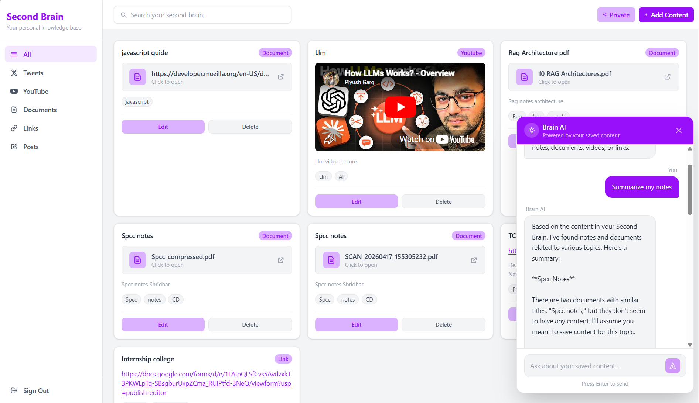
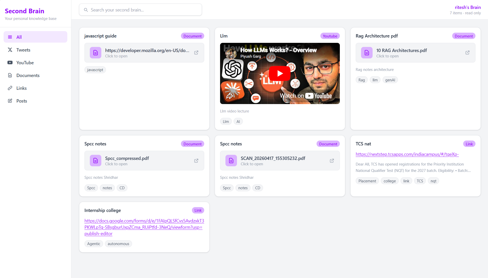

<div align="center">

<!-- Animated title using SVG -->


<br/>

<!-- Animated subtitle -->


<br/><br/>

<!-- Badges -->
<a href="https://second-brain-drab-two.vercel.app">
  
</a>
&nbsp;
<a href="https://secondbrain-backend.onrender.com/health">
  
</a>
&nbsp;

&nbsp;


<br/><br/>

<!-- Divider -->


</div>

<br/>

<!-- SCREENSHOT SECTION -->
<div align="center">

### Author View


### Public View


</div>

<br/>

---

## What is Second Brain

Second Brain is a full-stack AI-powered personal knowledge management system. It acts as your external memory — save YouTube videos, tweets, PDFs, links and notes in one place, then ask your AI assistant questions about everything you have saved.

<br/>

---

## Feature Overview

| Category    | Feature          | Description                                      |
| ----------- | ---------------- | ------------------------------------------------ |
| **Content** | Save YouTube     | Transcript is auto-fetched and embedded          |
| **Content** | Save Tweets      | Store with notes and tags                        |
| **Content** | Upload PDF       | Text extracted via pdf-parse, indexed for search |
| **Content** | Save Links       | Webpage is scraped and embedded                  |
| **Content** | Write Posts      | Plain text notes saved and indexed               |
| **AI**      | Semantic Search  | Find content by meaning, not just keywords       |
| **AI**      | RAG Chat         | Ask questions, get answers from your own content |
| **AI**      | Auto Embedding   | Every save is embedded in the background         |
| **AI**      | Re-index         | Manually re-embed failed content                 |
| **Sharing** | Share Brain      | Generate a public read-only link                 |
| **Sharing** | Shared View      | Visitors can filter and search your brain        |
| **Sharing** | Enable/Disable   | Author can enable and disable the share Link     |
| **Auth**    | Cookie Auth      | HTTP-only JWT cookies, secure in production      |
| **UX**      | Responsive       | Mobile, tablet, and desktop layouts              |
| **UX**      | Skeleton Loading | Smooth loading states                            |
| **UX**      | Error Boundary   | App never fully crashes                          |

<br/>

---

## Tech Stack

### Frontend

| Technology   | Version | Purpose                       |
| ------------ | ------- | ----------------------------- |
| React        | 18      | UI framework                  |
| Vite         | 5       | Build tool and dev server     |
| TypeScript   | 5       | Type safety                   |
| Tailwind CSS | 3       | Utility-first styling         |
| React Router | v6      | Client-side routing           |
| Axios        | latest  | HTTP client with interceptors |

### Backend

| Technology         | Version | Purpose                             |
| ------------------ | ------- | ----------------------------------- |
| Node.js            | 18+     | Runtime                             |
| Express            | 4       | REST API framework                  |
| TypeScript         | 5       | Type safety                         |
| Mongoose           | 8       | MongoDB ODM                         |
| JWT + bcrypt       | latest  | Authentication and password hashing |
| Multer             | latest  | Multipart file upload handling      |
| Zod                | 3       | Request body validation             |
| pdf-parse          | 1.1.1   | PDF text extraction                 |
| Cheerio + Axios    | latest  | Web scraping for links              |
| youtube-transcript | latest  | Auto-fetch YouTube transcripts      |

### AI and Storage

| Service          | Model / Plan                   | Purpose                         |
| ---------------- | ------------------------------ | ------------------------------- |
| Jina AI          | jina-embeddings-v3 (1024 dims) | Convert text to vectors         |
| MongoDB Atlas    | $vectorSearch                  | Cosine similarity vector search |
| Groq             | llama-3.1-8b-instant           | LLM for RAG chat responses      |
| Supabase Storage | Free tier                      | PDF and file storage            |

### Infrastructure

| Service  | Platform      | Purpose                          |
| -------- | ------------- | -------------------------------- |
| Frontend | Vercel        | Static hosting with CDN          |
| Backend  | Render        | Node.js web service              |
| Database | MongoDB Atlas | Cloud database with vector index |
| Storage  | Supabase      | Object storage for files         |

<br/>

---

## Architecture

```
+----------------------------------------------------------+
|                    USER BROWSER                          |
|               React + Vite  (Vercel)                     |
+-----------------------------+----------------------------+
                              |
                    HTTPS + Cookie Auth
                              |
                              v
+----------------------------------------------------------+
|                  EXPRESS REST API                        |
|                    (Render)                              |
|                                                          |
|   /auth    /content    /search    /chat    /brain        |
+------+----------+----------+--------+--------------------+
       |          |          |        |
       v          v          v        v
+----------+ +--------+ +-------+ +------------------+
| MongoDB  | |Supabase| | Jina  | |   Groq LLaMA3    |
|  Atlas   | |Storage | |  AI   | |   RAG Engine     |
| Database | | Files  | | Embed | |  Chat Answers    |
+----------+ +--------+ +-------+ +------------------+
```

### RAG Pipeline — How AI Chat Works

| Step | Action               | Detail                                               |
| ---- | -------------------- | ---------------------------------------------------- |
| 1    | User sends question  | "What do I know about system design?"                |
| 2    | Embed the question   | Jina AI converts query to 1024-dim vector            |
| 3    | Vector search        | MongoDB Atlas finds top 5 semantically similar docs  |
| 4    | Build prompt         | Inject matching documents as context into LLM prompt |
| 5    | LLM generates answer | Groq LLaMA3 answers using only user's saved content  |
| 6    | Return response      | `{ answer, sources[] }` sent back to frontend        |

### Embedding Pipeline — How Content Gets Indexed

| Content Type | Fetch Method               | Embedding Input      |
| ------------ | -------------------------- | -------------------- |
| YouTube      | youtube-transcript API     | Full transcript text |
| Link         | Cheerio webpage scraper    | Article body text    |
| Document     | pdf-parse on Supabase file | Extracted PDF text   |
| Tweet        | Not fetched                | Title + user notes   |
| Post         | Not fetched                | User notes directly  |

All types: `title + notes + extractedText` → Jina AI → 1024 numbers → saved to MongoDB

<br/>

---

## API Reference

| Method | Endpoint                      | Auth | Description                           |
| ------ | ----------------------------- | :--: | ------------------------------------- |
| POST   | `/api/v1/auth/signup`         |  No  | Register new user                     |
| POST   | `/api/v1/auth/signin`         |  No  | Login and set cookie                  |
| POST   | `/api/v1/auth/signout`        | Yes  | Logout and clear cookie               |
| POST   | `/api/v1/content/add`         | Yes  | Add content, supports file upload     |
| GET    | `/api/v1/content/get`         | Yes  | Get all user content                  |
| PUT    | `/api/v1/content/:id`         | Yes  | Update content                        |
| DELETE | `/api/v1/content/:id`         | Yes  | Delete content and file from Supabase |
| POST   | `/api/v1/content/reembed/:id` | Yes  | Re-index failed embedding             |
| GET    | `/api/v1/search?query=`       | Yes  | Semantic vector search                |
| POST   | `/api/v1/chat`                | Yes  | RAG chat with your brain              |
| POST   | `/api/v1/brain/share`         | Yes  | Generate or get share link            |
| GET    | `/api/v1/brain/:hash`         |  No  | Public view of shared brain           |
| GET    | `/health`                     |  No  | Health check for uptime monitoring    |

<br/>

---

## Project Structure

```
SecondBrain/
|
+-- backend/
|   +-- src/
|   |   +-- config/
|   |   |   +-- db.ts                    MongoDB connection
|   |   |   +-- supabase.ts              Supabase client init
|   |   |
|   |   +-- controllers/
|   |   |   +-- auth.controller.ts       Signup, signin, signout
|   |   |   +-- content.controller.ts    CRUD + file upload
|   |   |   +-- search.controller.ts     Vector search with $lookup
|   |   |   +-- chat.controller.ts       RAG chat entry point
|   |   |   +-- share.controller.ts      Share link generation
|   |   |   +-- tags.controller.ts       Tag upsert
|   |   |
|   |   +-- middleware/
|   |   |   +-- auth.middleware.ts       JWT cookie verification
|   |   |   +-- upload.middleware.ts     Multer memory storage
|   |   |
|   |   +-- models/
|   |   |   +-- user.model.ts
|   |   |   +-- content.model.ts         Includes embedding[] field
|   |   |   +-- tag.model.ts
|   |   |   +-- shareLink.model.ts
|   |   |
|   |   +-- routes/
|   |   |   +-- auth.route.ts
|   |   |   +-- content.route.ts
|   |   |   +-- search.route.ts
|   |   |   +-- chat.route.ts
|   |   |   +-- share.route.ts
|   |   |   +-- tags.route.ts
|   |   |
|   |   +-- services/
|   |   |   +-- embeddingService.ts      Jina AI + content fetch per type
|   |   |   +-- chatService.ts           RAG pipeline + Groq LLM
|   |   |   +-- fileService.ts           Supabase upload + PDF parse
|   |   |
|   |   +-- utils/
|   |   |   +-- tags.ts                  resolveTagIds helper
|   |   |   +-- hash.ts                  Share link hash generator
|   |   |
|   |   +-- types/
|   |   |   +-- express.d.ts             Augments Request with user_id
|   |   |
|   |   +-- app.ts                       Express app, CORS, routes
|   |   +-- server.ts                    Entry point, keep-alive ping
|   |
|   +-- package.json
|   +-- tsconfig.json
|
+-- frontend/
|   +-- src/
|   |   +-- api/
|   |   |   +-- axios.ts                 Axios instance + 401 interceptor
|   |   |
|   |   +-- components/
|   |   |   +-- ui/
|   |   |   |   +-- Button.tsx
|   |   |   |   +-- Card.tsx             All 5 content types + fileUrl
|   |   |   |   +-- Input.tsx
|   |   |   |   +-- Modal.tsx            Add and edit content form
|   |   |   |   +-- SearchBar.tsx
|   |   |   |   +-- Sidebar.tsx          Filter nav + signout
|   |   |   |   +-- SidebarItems.tsx
|   |   |   |   +-- SkeletonCard.tsx     Pulse loading skeleton
|   |   |   +-- ChatPanel.tsx        RAG chat with sources display
|   |   |   +-- ErrorBoundary.tsx    Class component error boundary
|   |   +-- hooks/
|   |   |   +-- useAuth.ts               signIn, signUp, signOut
|   |   |   +-- useContent.ts            fetch, add, delete, update, search
|   |   |
|   |   +-- icons/
|   |   |   +-- PlusIcon.tsx
|   |   |   +-- ShareIcon.tsx
|   |   |
|   |   +-- pages/
|   |   |   +-- Home.tsx                 Main dashboard
|   |   |   +-- SignIn.tsx
|   |   |   +-- SignUp.tsx
|   |   |   +-- SharedBrain.tsx          Public read-only view
|   |   |
|   |   +-- types/
|   |   |   +-- index.tsx                Content, Tag, User interfaces
|   |   |
|   |   +-- App.tsx                      Routes + PrivateRoute + ErrorBoundary
|   |   +-- main.tsx                     React entry point
|   |
|   +-- .env.production
|   +-- package.json
|   +-- tailwind.config.ts
|   +-- vite.config.ts
|
+-- README.md
```

<br/>

---

## Getting Started

### Prerequisites

| Requirement      | Version   | Link                                           |
| ---------------- | --------- | ---------------------------------------------- |
| Node.js          | 18+       | [nodejs.org](https://nodejs.org)               |
| MongoDB Atlas    | Free tier | [cloud.mongodb.com](https://cloud.mongodb.com) |
| Jina AI API key  | Free      | [jina.ai](https://jina.ai)                     |
| Groq API key     | Free      | [console.groq.com](https://console.groq.com)   |
| Supabase account | Free tier | [supabase.com](https://supabase.com)           |

### Setup

**1. Clone**

```bash
git clone https://github.com/riteshrana12-dev/SecondBrain.git
cd SecondBrain
```

**2. Backend**

```bash
cd backend
npm install
```

Create `backend/.env` — add these keys, do not commit this file:

| Key                 | Where to get it                   |
| ------------------- | --------------------------------- |
| `MONGO_URI`         | MongoDB Atlas → Connect → Drivers |
| `JWT_SECRET`        | Any long random string            |
| `JINA_API_KEY`      | jina.ai → API Keys                |
| `SUPABASE_URL`      | Supabase → Settings → API         |
| `SUPABASE_ANON_KEY` | Supabase → Settings → API         |
| `GROQ_API_KEY`      | console.groq.com → API Keys       |
| `CLIENT_URL`        | `http://localhost:5173` for dev   |
| `NODE_ENV`          | `development` for local           |

```bash
npm run dev
```

**3. Frontend**

```bash
cd frontend
npm install
```

Create `frontend/.env`:

```
VITE_API_URL=http://localhost:3000/api/v1
```

```bash
npm run dev
```

**4. MongoDB Atlas Vector Search Index**

Atlas → your cluster → Atlas Search → Create Index → Atlas Vector Search → JSON Editor:

```json
{
  "fields": [
    {
      "type": "vector",
      "path": "embedding",
      "numDimensions": 1024,
      "similarity": "cosine"
    },
    {
      "type": "filter",
      "path": "userId"
    }
  ]
}
```

Index name: `vector_index` | Database: `test` | Collection: `contents`

<br/>

---

## Deployment

### Backend — Render

| Setting        | Value                                        |
| -------------- | -------------------------------------------- |
| Root Directory | `backend`                                    |
| Build Command  | `npm install --include=dev && npm run build` |
| Start Command  | `node dist/server.js`                        |
| Instance Type  | Free                                         |

Add the same environment variables from `.env` in the Render dashboard under Environment tab. Set `NODE_ENV=production` and `CLIENT_URL=https://your-vercel-url.vercel.app`.

### Frontend — Vercel

| Setting          | Value                                                      |
| ---------------- | ---------------------------------------------------------- |
| Root Directory   | `frontend`                                                 |
| Framework        | Vite                                                       |
| Build Command    | `npm run build`                                            |
| Output Directory | `dist`                                                     |
| Env Variable     | `VITE_API_URL=https://your-render-url.onrender.com/api/v1` |

<br/>

---

## Design System

| Token         | Tailwind Class | Hex Value | Usage                           |
| ------------- | -------------- | --------- | ------------------------------- |
| Primary       | `purple-600`   | `#7164c0` | Buttons, links, active states   |
| Primary Light | `purple-300`   | `#a78bfa` | Tags, badges, secondary buttons |
| Background    | `gray-100`     | `#f3f4f6` | Page background                 |
| Surface       | `white`        | `#ffffff` | Cards, sidebar, topbar          |
| Border        | `gray-200`     | `#e5e7eb` | Card and input borders          |
| Text Primary  | `gray-800`     | `#1f2937` | Headings and body text          |
| Text Muted    | `gray-400`     | `#9ca3af` | Subtitles and placeholders      |
| Danger        | `red-500`      | `#ef4444` | Delete, error states            |
| Warning       | `yellow-600`   | `#ca8a04` | Not indexed badge               |
| Radius        | `rounded-xl`   | `0.75rem` | Cards and modals                |

<br/>

---

## Contributing

| Step   | Command                                      |
| ------ | -------------------------------------------- |
| Fork   | Click Fork on GitHub                         |
| Branch | `git checkout -b feat/your-feature`          |
| Commit | `git commit -m "feat: describe your change"` |
| Push   | `git push origin feat/your-feature`          |
| PR     | Open a Pull Request on GitHub                |

<br/>

---

<div align="center">


<br/><br/>

Built by **Ritesh Rana**

If this project helped you, consider giving it a ⭐ on GitHub.


</div>
